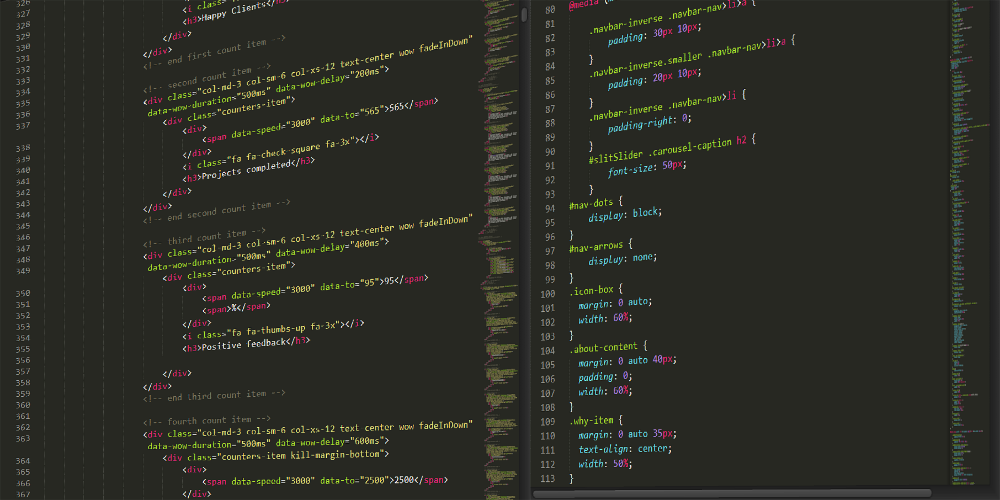

<!---Headings--->
# Heading 1
## Heading 2
### Heading 3
#### Heading 4
#### Heading 5
###### Heading 6

<!---Italics--->

<!---We can escape those italic characters by backslash--->

\*this text\* is italic

_this text_ is italic

<!---Strong--->

**this text** is italic

__this text__ is italic

<!---Strike Through--->

~~this text~~ is strike through

<!---Horizontal Rules--->

---
___

<!---Blockquotes--->

> this is a quote by me

<!---Links--->

[Mohamed Amine Qobaiche](https://www.facebook.com)

[Mohamed Amine Qobaiche](https://www.facebook.com
"Amine Qobaiche")

<!---UL--->

* Items1
* Items2
* Items3
* Items4
  * sub1
  * sub2
  * sub3
  * sub4

<!---OL--->

1. Item1
2. Item2
3. Item3
4. Item4

<!---Inline Code Block--->

``<p>Hey my name is jaja</p>``

<!---Images--->



<!---Github Readme--->

<!--- Code Blocks for github--->

```javascript
console.log("btn worked")
```
``` C
printf("Hey hey hey")
```
``` Css
.back {

    color: red;
}
```

<!---Tables--->

| Name     | Email          |
| -------- | -------------- |
| John Doe | john@gmail.com |
| Jane Doe | jane@gmail.com |

<!-- Task List -->
<!---it means the task is done or not--->
* [x] Task 1
* [x] Task 2
* [ ] Task 3

<!---Keep in mind there are a converter from markdown to html--->


